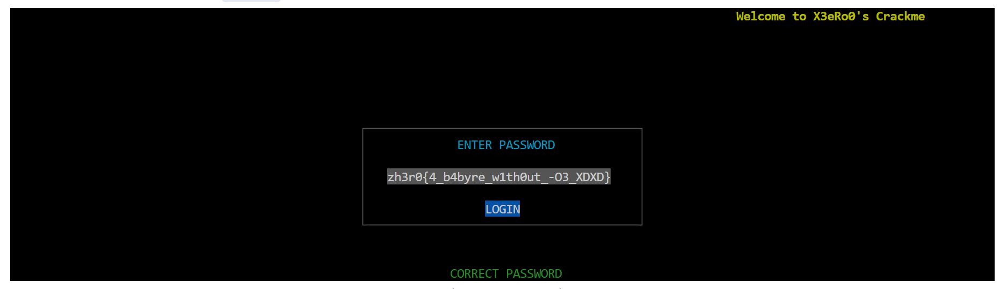

# 3.babyre

Reverse Engineering Challenge

<div class="pt-12">
  <span @click="$slidev.nav.next" class="px-2 py-1 rounded cursor-pointer" hover="bg-white bg-opacity-10">
    Press Space for next page <carbon:arrow-right class="inline"/>
  </span>
</div>

---
layout: default
---

# Challenge Overview

<div class="grid grid-cols-2 gap-4">

<div>

## Target
- **Binary**: `babyre`
- **Type**: ELF 64-bit LSB executable
- **Goal**: Find the correct password (Flag)

</div>

<div>

## Initial Run

<v-click>


</v-click>

<v-click>

- Output: `INCORRECT PASSWORD`
- Strategy: Search for this string

</v-click>

</div>

</div>

---

# Initial Reconnaissance

Using `strings` to find the offset of the error message.

```bash {all|2|3}
lwb@DESKTOP-JNTORIG ~/cyptro$ strings -tx babyre > babyre.txt    
   2017 INCORRECT PASSWORD
   202a ENTER PASSWORD
   2039 LOGIN
```

<v-click>

- String `INCORRECT PASSWORD` found at offset `0x2017`
- We can use this offset to locate the code referencing it.

</v-click>

---
layout: two-cols
---

# Locating the Logic

Locating the code that references `0x2017`.

<v-click>

```asm {all|1|3-4|10}
162c: call   1560 <usleep@plt+0x1b0>  # Check password
1631: xor    %edx,%edx
1633: test   %rax,%rax                # Check result
1636: jne    1678                     # Jump if fail
1638: mov    $0x100,%esi
163d: mov    %rbp,%rdi
1640: call   12f0 <wattr_on@plt>
...
164e: lea    0x9af(%rip),%rcx        # Ref to String
```

</v-click>

::right::

<div class="ml-4 mt-10">

<v-click>

### Analysis

1.  **Line 162c**: Calls a function (likely the check).
2.  **Line 1633**: Checks the return value (`rax`).
3.  **Line 1636**: Jumps to failure path if not zero (or zero, depending on logic).
4.  **Line 164e**: Loads the "INCORRECT PASSWORD" string.

</v-click>

</div>

---

# The Check Logic

Inside the checking function (found at `159b`):

```asm {all|1-2|8-11}
159b: cmp    $0x20,%r8            # Check 1: Length must be 0x20 (32)
159f: jne    15db                 # Fail if length != 32

...

15c5: mov    $0x20,%edx
15ca: lea    0x2a4f(%rip),%rsi    # Target Data at 0x4020
15d1: mov    %r12,%rdi            # Transformed Input
15d4: call   1310 <memcmp@plt>    # Check 2: Compare memory
```

<v-click>

### Two Conditions:
1.  **Length**: Must be 32 bytes.
2.  **Content**: Transformed input must match data at `0x4020`.

</v-click>

---
layout: two-cols
---

# The Transformation

Analyzing the transformation loop:

```asm {all|10|13-16}
1500: movzbl (%rdi,%r10,1),%r8d  # input[i]
...
1510: movzbl (%rax),%esi         # output[j]
1513: mov    %r8d,%edx           # copy input[i]
1516: add    $0x1,%rax           # j++
151a: shr    %r8b                # input[i] >> 1
151d: and    $0x1,%edx           # bit = (input[i] >> 1) & 1
1520: shl    %cl,%edx            # bit << i
1522: or     %esi,%edx           # output[j] | bit
1524: mov    %dl,-0x1(%rax)      # Store back
```

::right::

<div class="ml-4">

### Algorithm Analysis

<v-click>

The code iterates through each byte of input (`i`) and each bit of that byte (`j` implied by loop).

It performs:
$$ \text{output}[j] \ |= \ (\text{input}[i] \ \& \ 1) \ll i $$

</v-click>

<v-click>

### Interpretation

This is a **Bit Matrix Transposition**.
- The $j$-th bit of byte $i$ becomes the $i$-th bit of byte $j$.
- It swaps rows and columns of the 8x8 bit matrix.

</v-click>

</div>

---

# Algorithm Visualization

**Bit Matrix Transpose (8x8)**

<div class="grid grid-cols-2 gap-10">

<div>

### Input (Byte $i$)
Bit $j$ contributes to...

```python
input[i] = [b7, b6, ..., bj, ..., b0]
```

</div>

<div>

### Output (Byte $j$)
...Bit $i$ of Output Byte $j$

```python
output[j] |= (input[i][j] << i)
```

</div>

</div>

<br>

<v-click>

### Verification
If we input 32 `'a'`s (`0x61` = `01100001`), the output pattern repeats every 8 bytes:
`0xff 0x00 0x00 0x00 0x00 0xff 0xff 0x00`

This confirms our analysis.

</v-click>

---

# The Solution

Since the operation is a **Transpose**, the inverse operation is **Transpose** again!

$(A^T)^T = A$

<div class="grid grid-cols-2 gap-4">

<div>

### Inverse Script

```python
def inverse_transform(output):
    input_bytes = [0] * 8
    for i in range(8):
        for j in range(8):
            # Extract bit i from output[j]
            bit = (output[j] >> i) & 1
            # Put at bit j of input[i]
            input_bytes[i] |= (bit << j)
    return input_bytes
```

</div>

<div>

### Target Data (`0x4020`)

```
0x4020: a4 ad c0 a3 fd 7f ab 00
0x4028: e8 d5 e2 48 da bf fd 00
0x4030: d1 40 f2 c4 7b bf 76 00
0x4038: 87 07 d5 ad ae 82 fd 00
```

</div>

</div>

---

# The Result

Running the inverse transform on the data from `0x4020`:

```python
target = bytes([
    0xa4, 0xad, 0xc0, 0xa3, 0xfd, 0x7f, 0xab, 0x00,
    0xe8, 0xd5, 0xe2, 0x48, 0xda, 0xbf, 0xfd, 0x00,
    0xd1, 0x40, 0xf2, 0xc4, 0x7b, 0xbf, 0x76, 0x00,
    0x87, 0x07, 0xd5, 0xad, 0xae, 0x82, 0xfd, 0x00
])
print(inverse_transform_32bytes(target))
```

<v-click>

<div class="text-center mt-10 text-2xl font-bold text-green-500 border-2 border-green-500 p-4 rounded-lg">
  zh3r0{4_b4byre_w1th0ut_-O3_XDXD}
</div>

</v-click>

<v-click>

<div class="flex justify-center mt-4">
  
</div>

</v-click>

---
class: text-center
---

# Thanks

Q & A
